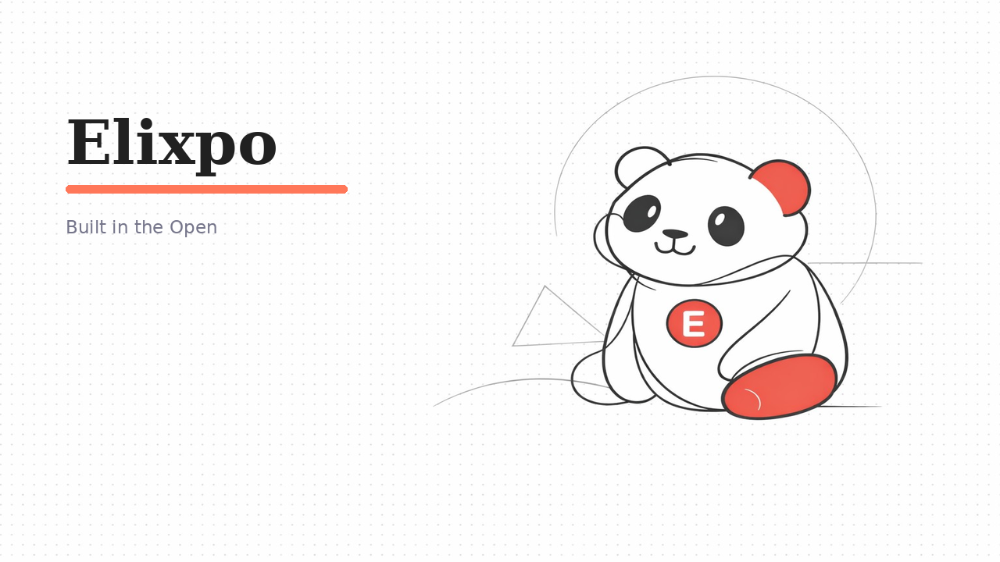

<p align="center">
  
</p>

<h1 align="center">elixpo/brand</h1>

<p align="center">
  <strong>The originating home of the Elixpo brand.</strong><br/>
  The brand source of truth, the asset-generation pipeline, and the generated
  sticker, icon, and mascot sets. Everything orbits around <strong>Oreo</strong>,
  the pixel-art panda mascot.
</p>

<p align="center">
  <a href="https://elixpo.com/assets">Brand kit</a> ·
  <a href="https://github.com/orgs/elixpo/discussions">Discussions</a> ·
  <a href="https://github.com/elixpo/elixpo_chapter">Monorepo</a> ·
  <a href="https://github.com/sponsors/Circuit-Overtime">Sponsor</a>
</p>

---

## About

This repository defines the Elixpo brand and the tooling that produces it.
Browse the finished assets in [`branding/`](branding/), read the rules in
[`references/MASCOT.md`](references/MASCOT.md), or open an issue to request a new
one. A browsable, downloadable kit also lives at
**[elixpo.com/assets](https://elixpo.com/assets)**.

## Repository layout

```
references/   Brand source-of-truth: MASCOT.md (identity, palette, rules),
              OREO-LINEART.md, and image_models.md (model registry).
prompts/      Prompt sources, by class: brand · icons · og · stickers · videos.
pipeline/     Generation + processing code (Python + Pillow).
branding/     Generated brand marks (brand/), web icons (icons/web/),
              PWA bundles (pwa/), and per-product OG cards (og/).
stickers/     Generated 1024² sticker PNGs (transparent, optimised).
videos/       Generated mascot MP4s.
editing/      The Elixpo "scrapbook" photo effect (klein).
docs/         Generation guides.
requested/    Community asset-request outputs.
```

> **Where assets go:** stickers, marks, icons, and mascot clips live here.
> Per-product **Open Graph images** are generated into `branding/og/<site>/` and
> **distributed to the individual product repos** - the prompts and code stay here.

## Requesting an asset

1. **Open an issue** using the **"Sticker / Icon Request"** template and
   describe the vibe in a line or two.
2. A maintainer reviews it against [`references/MASCOT.md`](references/MASCOT.md)
   and applies the **`approved`** label.
3. A GitHub Action renders it via Pollinations, runs the transparency pass, and
   commits the result, then comments with a link. Add **`regenerate`** to reroll.

The review step is intentional - it keeps the brand from drifting.

## Generation & locking

The pipeline lives in [`pipeline/`](pipeline/) (`generate_assets.py` plus
helpers). Finished brand marks and OG cards are **locked** - once committed, they
are kept rather than re-rendered, so the official identity never drifts by
accident. Pass `--force` (or delete the file) to intentionally reroll. See
[`prompts/brand/README.md`](prompts/brand/README.md).

## Standards

This repository follows the **Elixpo standard**, shared by every Elixpo repo
(see [`STANDARDS.md`](https://github.com/elixpo/elixpo/blob/main/STANDARDS.md)):

- [`LICENSE`](LICENSE) + [`LICENSES/`](LICENSES/) - the Elixpo License (MIT for
  code, CC-BY-4.0 for assets) and the
  [Oreo-trademarks exception](LICENSES/exceptions/Oreo-trademarks).
- [`LICENSES/NOTICE`](LICENSES/NOTICE) - the notice board (per-repo reservations).
- [`CODE_OF_CONDUCT.md`](CODE_OF_CONDUCT.md) and [`CONTRIBUTING.md`](CONTRIBUTING.md).

## License & brand

- The **Oreo mascot**, the **chest E-badge**, and the **palette** in
  [`references/MASCOT.md`](references/MASCOT.md) are © 2026 Ayushman Bhattacharya
  and part of the copyright registration (Indian Copyright Office Diary
  `LD-26455/2026-CO`).
- Assets are CC-BY-4.0; the licence covers the **files**, not the **Oreo
  character / Elixpo brand** for use outside Elixpo-aligned projects. See
  [`LICENSES/exceptions/Oreo-trademarks`](LICENSES/exceptions/Oreo-trademarks).

## Exclusive

> Per-repo reserved artifacts are declared in [`LICENSES/NOTICE`](LICENSES/NOTICE).

**This repository:** the brand itself - the Oreo mascot, names, and palette are
reserved. The generated asset files are free to use under CC-BY-4.0.

<p align="center">
  <sub>Made in the open, together. © 2023-2026 Elixpo.</sub>
</p>
